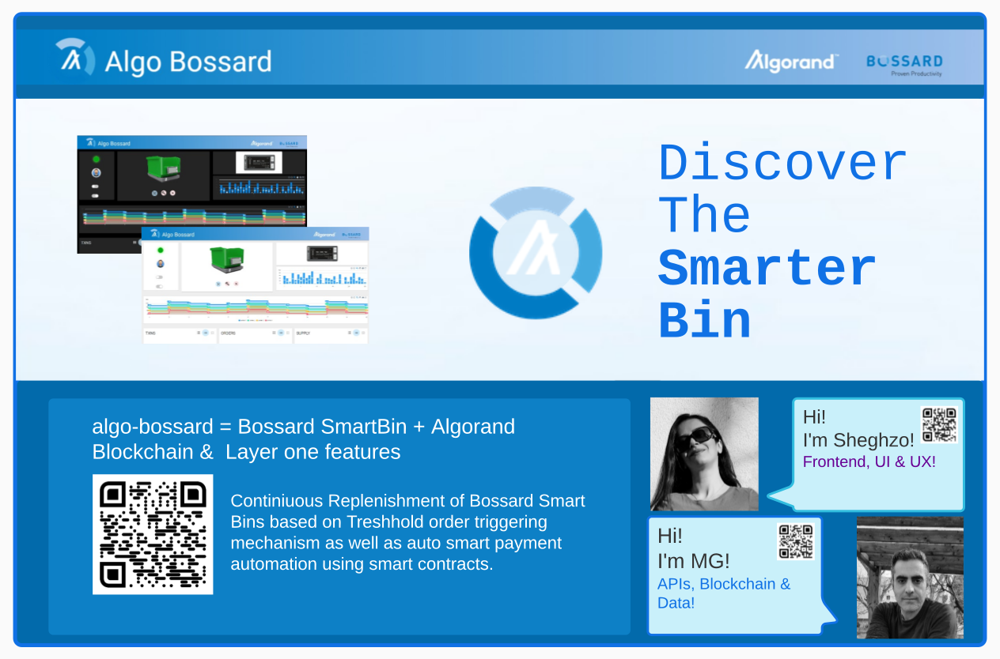
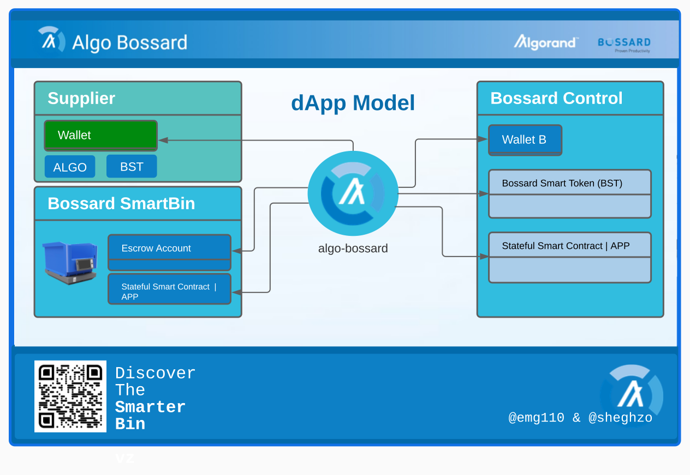
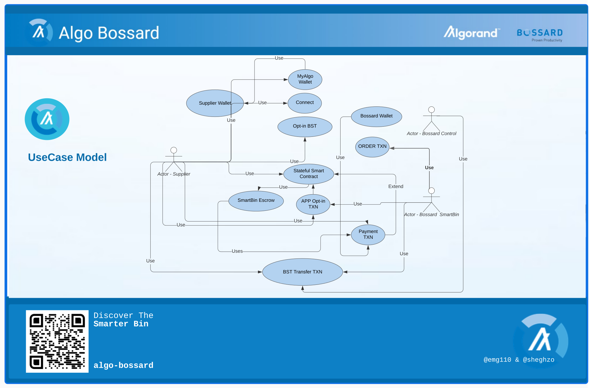
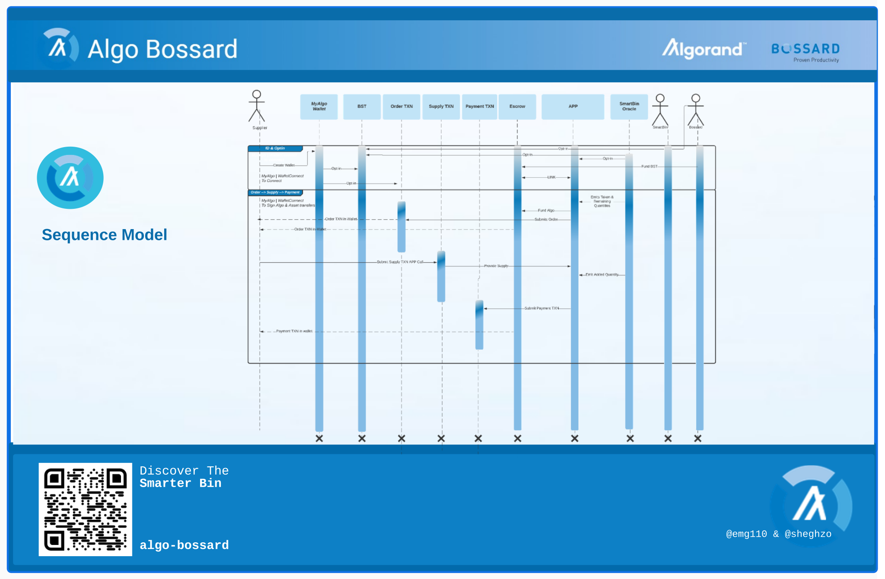
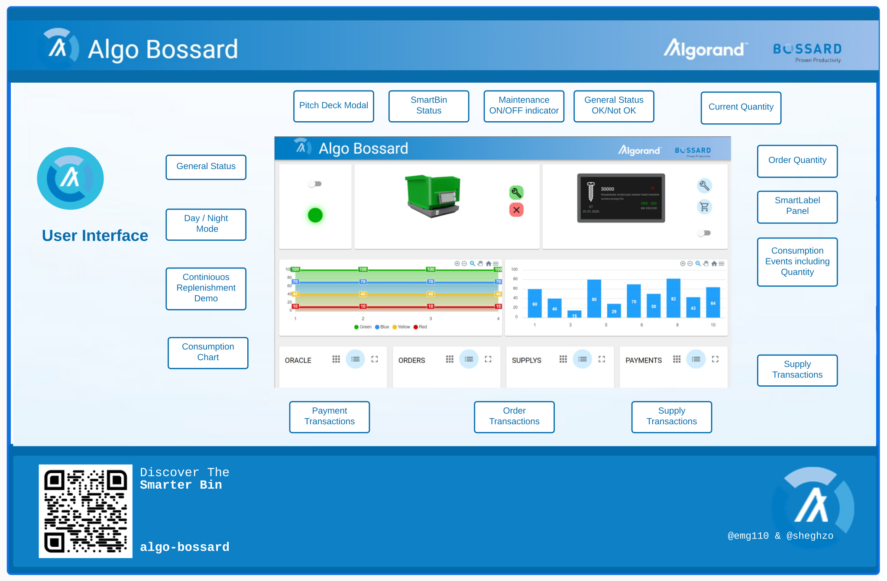
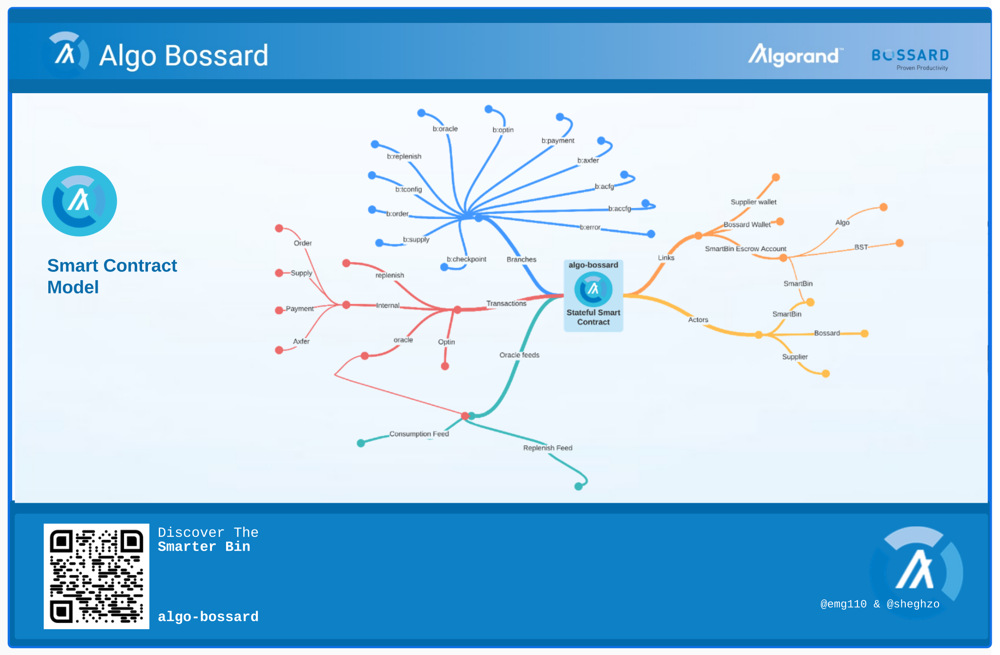
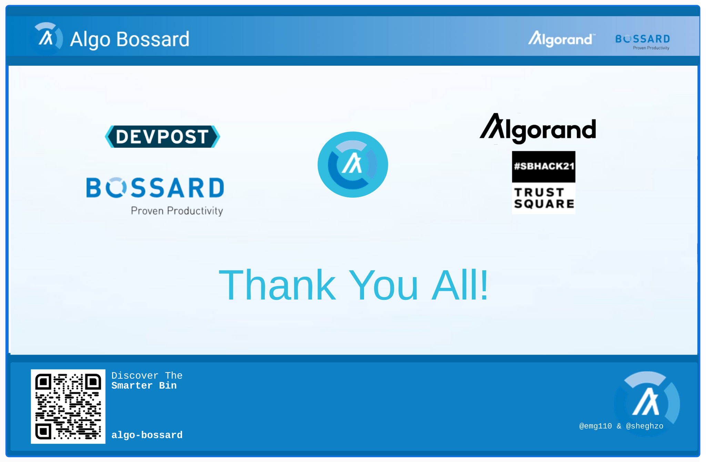

# algo-bossard

#### Bossard's Smart Bin Continuous Replenishment using Algorand stateful and stateless smart contracts, standard assets and atomic transfers.

Prepared For Swiss Blockchain Hackathon 2021 ([#SBHACK2021](https://sbhack21.devpost.com/)) , in response to [Bossard](https://www.bossard.com/) challenge related to [Bossard](https://www.bossard.com/) SmartBins.

## [Live Demo](https://algo-bossard.pages.dev)
_____

> 

> 

> 

> 

> 

> 

